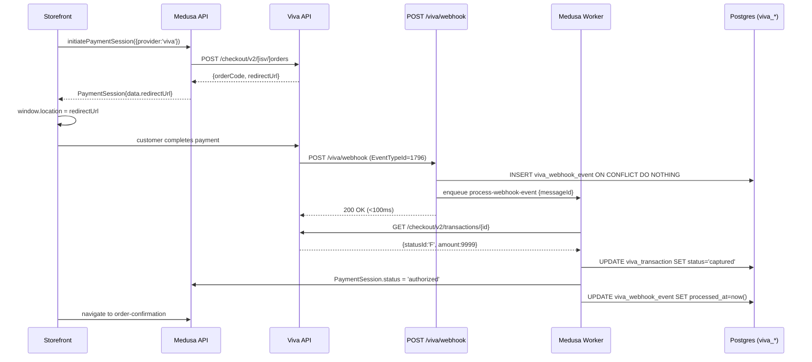

# @sakeetech/medusa-payment-viva

Medusa v2 payment provider for **Viva Wallet** — multi-mode (merchant + ISV).
Wraps [`@sakeetech/viva-payments-core`](../viva-payments-core) and adapts it to
Medusa's `AbstractPaymentProvider` interface. Smart Checkout end-to-end:
`initiatePayment`, `authorizePayment`, `capturePayment`, `refundPayment`,
`cancelPayment`, plus webhook receiver, idempotent job processing, internal
metrics, and a `viva-register-webhooks` CLI.

---

> **v0.2.0 — alpha. Live demo verification pending.**
>
> Upgrading from `0.1.x`? See [`docs/MIGRATION-0.1-to-0.2.md`](https://github.com/sakee-tech/vivawallet-npm-public/blob/main/docs/MIGRATION-0.1-to-0.2.md).
> All locked decisions (auth, endpoints, webhook contract, error envelope, state
> machine) live in `docs/` — this README links into them rather than duplicating.

---

## Mode matrix

The plugin runs in one of two operational modes. **`merchant` is the default**
(90% case). Set `VIVA_MODE=isv` to opt into ISV multi-tenant mode.

| Capability | `merchant` *(default)* | `isv` *(opt-in)* |
|---|---|---|
| **Who it's for** | Single direct Viva merchant — your store, your account | SaaS / platform onboarding many merchants under one ISV partner agreement |
| **Required credentials** | One OAuth2 pair (`VIVA_CLIENT_ID`/`SECRET`) + one Basic pair (`VIVA_MERCHANT_ID`/`API_KEY`) | Platform-wide OAuth2 pair + legacy Basic pair + optional Reseller Basic pair (`VIVA_RESELLER_*`) |
| **OAuth2 scope** | `urn:viva:payments:core:api:redirectcheckout` (+ `acquiring` for Fast Refund) | `urn:viva:payments:core:api:isv` (+ `acquiring`) |
| **Per-call merchant scoping** | None — token IS the merchant | `?merchantId={uuid}` query on every Smart Checkout / transaction call |
| **Onboarding flow** | None — merchant signs up with Viva directly | `POST /isv/v1/accounts` → hosted KYC → 8194 verification webhook |
| **Tenant resolver** | Bypassed | `DefaultTenantResolver` reads `merchantId` from cart / store custom field |
| **Webhook registration** | Manual — Self Care UI; CLI prints the URLs + verification key | Automated — CLI calls `POST /isv/v1/webhooks` |
| **Webhook events handled** | 1796, 1797, 1798, 4865 | …plus 8193 (Account Connected), 8194 (Account Verification) |
| **Admin REST surface** | `GET /viva/internal/*`, `GET /viva/webhook/health` | …plus `POST/GET /viva/admin/connected-accounts/*`, `POST .../sources` |
| **Refund paths** | Fast Refund (Visa/MC) → Standard refund (legacy Basic auth) | Same, plus optional per-tenant approval state |

If `VIVA_MODE` is unset, the plugin **defaults to `'merchant'`** and prints a
one-time startup warning. Set the flag explicitly to silence it.

---

## Prerequisites

| Requirement | Notes |
|---|---|
| **Medusa v2** | `@medusajs/framework ^2.0`, `@medusajs/types ^2.0` (peer deps) |
| **Postgres** | Medusa default. The plugin adds two tables: `viva_transaction`, `viva_webhook_event`. |
| **Node.js ≥ 20** | |
| **A Viva account** | Direct merchant (Self Care → API Access → Smart Checkout) — OR — ISV partner credentials. Demo + production use the same credential pair; `VIVA_ENVIRONMENT` switches the base URL. |
| **Worker process** | Medusa's built-in worker runs the webhook processing workflow. No separate Redis-backed queue required (BullMQ optional for multi-worker locks). |

---

## Install

```bash
pnpm add @sakeetech/medusa-payment-viva
```

Peer dependencies (already in any Medusa v2 project):

```bash
pnpm add @medusajs/framework @medusajs/types
```

---

## Quick start — merchant mode

The 90% case. You have a single Viva merchant account and want to take payments
on a single Medusa store.

### 1. Get credentials from Viva Self Care

In [Viva Self Care](https://demo.vivapayments.com) → **Settings → API Access**:

- **Smart Checkout credentials** → `clientId` + `clientSecret` (OAuth2 pair).
- **Merchant ID + API Key** → Basic-auth pair (used by refunds — probe-verified
  2026-04-25, only the legacy host accepts the refund call).

### 2. Configure env vars

```bash
# .env
VIVA_MODE=merchant                          # optional (default)
VIVA_ENVIRONMENT=demo                       # 'demo' | 'production'
VIVA_CLIENT_ID=your-smart-checkout-client-id
VIVA_CLIENT_SECRET=your-smart-checkout-client-secret
VIVA_MERCHANT_ID=your-merchant-uuid         # for refunds
VIVA_API_KEY=your-api-key                   # for refunds
VIVA_WEBHOOK_VERIFICATION_KEY=              # leave empty until step 4
VIVA_SOURCE_CODE=Default                    # optional; Smart Checkout source code
VIVA_ADMIN_TOKEN=long-random-string         # optional; gates /viva/internal/*
VIVA_WEBHOOK_BASE_URL=https://your-store.com
```

### 3. Wire the provider into `medusa-config.ts`

```ts
import { defineConfig } from '@medusajs/framework/utils';

export default defineConfig({
  modules: {
    payment: {
      resolve: '@medusajs/medusa/payment',
      options: {
        providers: [
          {
            resolve: '@sakeetech/medusa-payment-viva',
            id: 'viva',
            options: {
              // The provider reads VIVA_* env vars at load time via
              // loadConfigFromEnv(). No options need to be passed here for the
              // default case — every knob is an env var. See §Configuration.
            },
          },
        ],
      },
    },
  },
});
```

### 4. Register webhooks (manual — merchant mode)

Viva does not expose a programmatic webhook-registration API for direct
merchants. The CLI fetches the verification key for you and prints the URLs
you paste into Self Care.

```bash
pnpm exec viva-register-webhooks --apply
```

Output:

```
Manual webhook setup required (merchant mode).

1. Go to Viva Self Care → Sales → API Access → Webhooks.
2. For each event below, register the URL with your storefront base URL:

   Transaction Payment Created (1796):   https://your-store.com/viva/webhook
   Transaction Reversal Created (1797):  https://your-store.com/viva/webhook
   Transaction Payment Failed (1798):    https://your-store.com/viva/webhook
   Order Updated (4865):                 https://your-store.com/viva/webhook

3. Paste this verification key into VIVA_WEBHOOK_VERIFICATION_KEY in .env:
   <uuid-printed-here>

4. Restart your Medusa server.
```

Paste the verification key into `.env` and restart Medusa.

> See [`docs/WEBHOOKS.md`](https://github.com/sakee-tech/vivawallet-npm-public/blob/main/docs/WEBHOOKS.md) for the full envelope shape
> and per-event payload reference.

### 5. Run migrations

```bash
pnpm medusa db:migrate
```

Creates `viva_transaction` and `viva_webhook_event` tables.

### 6. Take a payment from the storefront

The provider exposes a `viva` payment session via Medusa's standard payment
flow. Your storefront calls:

```ts
// 1. Create a payment session
await medusa.store.payment.initiatePaymentSession({
  cart_id: cartId,
  provider_id: 'pp_viva_viva',
});

// 2. Read the redirect URL from session.data
const { payment_session } = await medusa.store.payment.retrievePaymentSession(...);
const redirectUrl = payment_session.data.redirectUrl;

// 3. Send the customer to Smart Checkout
window.location.href = redirectUrl;
```

After the customer completes payment, Viva fires webhook `1796` to
`/viva/webhook`. The worker retrieves the transaction, validates the amount,
and transitions the payment session to `authorized` (Medusa's terminal success
state for capture — see [`docs/STATE-MACHINE.md`](https://github.com/sakee-tech/vivawallet-npm-public/blob/main/docs/STATE-MACHINE.md) §4.2).

---

## Quick start — ISV mode

<details>
<summary>Click to expand — ISV multi-tenant onboarding flow</summary>

ISV mode is for SaaS platforms onboarding many merchants under one ISV partner
agreement with Viva. You hold platform-wide OAuth2 credentials; each merchant
goes through Viva's hosted KYC to attach to your platform.

### 1. Get ISV credentials

Under your ISV partner contract, Viva issues a **single platform-wide** OAuth2
pair (`clientId` / `clientSecret`). Same pair for demo + production;
`VIVA_ENVIRONMENT` flips the host.

If you'll call `POST /api/sources` to create payment sources for connected
merchants, you'll also need the Reseller Basic pair (`resellerId`,
`merchantId`, `resellerApiKey`).

### 2. Configure env vars

```bash
VIVA_MODE=isv
VIVA_ENVIRONMENT=demo
VIVA_CLIENT_ID=isv-client-id
VIVA_CLIENT_SECRET=isv-client-secret
VIVA_MERCHANT_ID=isv-legacy-merchant-id       # for refund Basic auth
VIVA_API_KEY=isv-legacy-api-key               # for refund Basic auth
VIVA_WEBHOOK_VERIFICATION_KEY=                # set after step 4
VIVA_ADMIN_TOKEN=long-random-string
VIVA_WEBHOOK_BASE_URL=https://your-saas.com

# Optional — only required if you call POST /viva/admin/.../sources
VIVA_RESELLER_ID=reseller-uuid
VIVA_RESELLER_MERCHANT_ID=reseller-merchant-uuid
VIVA_RESELLER_API_KEY=reseller-api-key
```

> All three `VIVA_RESELLER_*` vars are **all-or-nothing**. Setting only some
> raises a validation error at boot.

### 3. Register webhooks (automated — ISV mode)

```bash
pnpm exec viva-register-webhooks --dry-run   # preview
pnpm exec viva-register-webhooks --apply     # call POST /isv/v1/webhooks
```

The CLI posts one webhook URL per V1 event type to Viva. Idempotent — re-running
emits `SKIP_ALREADY_REGISTERED` actions and exits 0.

### 4. Onboard a merchant

```bash
curl -X POST https://your-saas.com/viva/admin/connected-accounts \
  -H "Authorization: Bearer $VIVA_ADMIN_TOKEN" \
  -H 'Content-Type: application/json' \
  -d '{
    "email": "shop@example.com",
    "returnUrl": "https://your-saas.com/onboarding/done",
    "branding": { "partnerName": "YourSaaS", "logoUrl": "https://..." }
  }'
# → { "accountId": "...", "onboardingUrl": "https://..." }
```

Send `onboardingUrl` to the merchant. They complete Viva's hosted KYC. When
Viva verifies the account, webhook 8194 fires and the plugin records the
verification status. Tenant resolution against `merchantId` becomes possible.

### 5. Per-cart tenant resolution

The plugin's `DefaultTenantResolver` reads `merchantId` from the cart's metadata
or the store's custom field. Override with a custom resolver in your provider
options — see `src/resolvers/tenant-resolver.ts`.

</details>

---

## Configuration

### Plugin provider options (`medusa-config.ts`)

```ts
{
  resolve: '@sakeetech/medusa-payment-viva',
  id: 'viva',
  options: {
    // All configuration is read from VIVA_* env vars at load time via
    // loadConfigFromEnv(). The options object is reserved for future
    // injection hooks (custom tenant resolver, logger, etc.).
  },
}
```

The provider calls `loadConfigFromEnv(process.env)` internally and constructs
the discriminated `VivaPluginConfig` union (`VivaMerchantConfig | VivaIsvConfig`)
— see `src/config.ts`.

### Environment variables — required (both modes)

| Variable | Purpose |
|---|---|
| `VIVA_CLIENT_ID` | OAuth2 client_id. Merchant mode: your Smart Checkout creds. ISV mode: platform-wide ISV pair. |
| `VIVA_CLIENT_SECRET` | OAuth2 client_secret. |
| `VIVA_MERCHANT_ID` | Legacy Basic-auth Merchant ID. Required in **both modes** for refunds — probe-verified 2026-04-25 (F1): `POST /checkout/v2/transactions/{id}` returns 405, only `POST /api/transactions/{id}` on the legacy host works. |
| `VIVA_API_KEY` | Legacy Basic-auth API Key. Pairs with `VIVA_MERCHANT_ID`. |
| `VIVA_WEBHOOK_VERIFICATION_KEY` | URL-verify response key. Merchant: from `GET /api/messages/config/token`. ISV: from `GET /isv/v1/webhooks/token`. The CLI fetches this for you. |

### Environment variables — optional (both modes)

| Variable | Default | Purpose |
|---|---|---|
| `VIVA_MODE` | `'merchant'` (auto-detected as `'isv'` if any `VIVA_RESELLER_*` is set) | `'merchant'` or `'isv'`. |
| `VIVA_ENVIRONMENT` | `'demo'` | `'demo'` or `'production'`. |
| `VIVA_REFUND_STRATEGY` | `'auto'` | `'auto'` (Fast → Standard fallback) / `'fast'` (Fast only) / `'standard'` (skip Fast). |
| `VIVA_SOURCE_CODE` | `'Default'` | Smart Checkout source code. Merchant mode only. |
| `VIVA_ADMIN_TOKEN` | unset | Bearer token gating `/viva/internal/*` and `/viva/admin/*`. When unset in production, internal endpoints return `401 admin-token-not-configured`. |
| `VIVA_WEBHOOK_BASE_URL` | unset | Your storefront origin. Used by the CLI to construct the webhook URL. Required by the CLI. |
| `VIVA_WEBHOOK_IP_ALLOWLIST` | unset | Comma-separated extra CIDRs added on top of Viva's documented source IPs. Read directly by the `/viva/webhook` route handler (Medusa file-based routes can't access plugin options). |
| `VIVA_WEBHOOK_IP_ALLOWLIST_BYPASS` | unset | Set to `'true'` to skip the IP allowlist gate in dev/test only. Never set in production. |
| `VIVA_TRUSTED_PROXY_DEPTH` | `0` | How many trailing `X-Forwarded-For` hops the deployment terminates. `0` = direct exposure (default, uses socket address). `1` = one reverse proxy (nginx/Caddy/ALB). `2` = CDN + LB (e.g. Cloudflare → ALB). Setting this correctly is **required** to prevent IP-allowlist bypass via header spoofing — see "Webhook firewall configuration" below. |

### Environment variables — ISV-only

All three are **all-or-nothing**. Required only if you call
`POST /viva/admin/connected-accounts/:id/sources` (which uses the
Reseller Basic auth variant — see [`docs/AUTH.md`](https://github.com/sakee-tech/vivawallet-npm-public/blob/main/docs/AUTH.md)).

| Variable | Purpose |
|---|---|
| `VIVA_RESELLER_ID` | Reseller UUID. |
| `VIVA_RESELLER_MERCHANT_ID` | Reseller's own merchant UUID (paired with the reseller credential, not the connected merchant). |
| `VIVA_RESELLER_API_KEY` | Reseller API key. |

### Deprecated aliases (one-minor back-compat)

Accepted in `0.2.x` with a startup deprecation warning. **Removed in `0.3.0`.**

| Deprecated | Use instead |
|---|---|
| `VIVA_ISV_CLIENT_ID` | `VIVA_CLIENT_ID` |
| `VIVA_ISV_CLIENT_SECRET` | `VIVA_CLIENT_SECRET` |

> See [`docs/MIGRATION-0.1-to-0.2.md`](https://github.com/sakee-tech/vivawallet-npm-public/blob/main/docs/MIGRATION-0.1-to-0.2.md) for
> the full upgrade path.

---

## Admin REST contract

All admin endpoints require `Authorization: Bearer $VIVA_ADMIN_TOKEN`.

### Mode availability

| Path | merchant | isv |
|---|---|---|
| `POST /viva/admin/connected-accounts` | 404 | mounted |
| `GET /viva/admin/connected-accounts/:id` | 404 | mounted |
| `POST /viva/admin/connected-accounts/:id/reconcile` | 404 | mounted |
| `POST /viva/admin/connected-accounts/:id/sources` | 404 | mounted (requires `VIVA_RESELLER_*` or returns 412) |
| `GET /viva/internal/auth-status` | mounted | mounted |
| `GET /viva/webhook/health` | mounted | mounted |
| `GET /viva/internal/metrics` | mounted | mounted |
| `GET /viva/webhook` | mounted | mounted |
| `POST /viva/webhook` | mounted | mounted |

ISV-only routes return `404 not_found` in merchant mode (per-handler short-circuit
via `_mode-gate.ts` — Medusa v2 has no clean way to skip a `route.ts` file at
boot based on plugin config).

> Full path detail, request / response shapes, and curl examples in
> [`docs/ENDPOINTS.md`](https://github.com/sakee-tech/vivawallet-npm-public/blob/main/docs/ENDPOINTS.md) §3 (adapter endpoints).

### `GET /viva/internal/auth-status`

```bash
curl https://your-store.com/viva/internal/auth-status \
  -H "Authorization: Bearer $VIVA_ADMIN_TOKEN"
```

Response `200`:

```json
{
  "token_present": true,
  "token_expires_at": "2026-05-12T11:00:00.000Z",
  "last_refresh_at": "2026-05-12T10:00:00.000Z"
}
```

### `GET /viva/webhook/health`

```bash
curl https://your-store.com/viva/webhook/health \
  -H "Authorization: Bearer $VIVA_ADMIN_TOKEN"
```

Response `200`:

```json
{
  "events_received_24h": 42,
  "events_pending": 0,
  "oldest_pending_age_seconds": 0,
  "last_processed_at": "2026-05-12T10:01:23.000Z"
}
```

### `POST /viva/admin/connected-accounts` *(ISV only)*

```bash
curl -X POST https://your-saas.com/viva/admin/connected-accounts \
  -H "Authorization: Bearer $VIVA_ADMIN_TOKEN" \
  -H 'Content-Type: application/json' \
  -d '{
    "email": "shop@example.com",
    "returnUrl": "https://your-saas.com/onboarding/done"
  }'
```

Response `200`:

```json
{
  "accountId": "eeeeeeee-ffff-0000-1111-222222222222",
  "onboardingUrl": "https://www.vivapayments.com/onboarding/..."
}
```

### `POST /viva/admin/connected-accounts/:id/reconcile` *(ISV only)*

Manually re-fetches a connected account's verification state and writes it
locally. Use this if webhook 8194 was missed.

### `POST /viva/admin/connected-accounts/:id/sources` *(ISV only)*

Creates a Smart Checkout source via `POST /api/sources` against the **Reseller
Basic-auth** legacy host. Returns `412 viva_reseller_credentials_missing` if
`VIVA_RESELLER_*` are not configured.

### Webhook endpoints

| Verb | Path | Auth | Description |
|---|---|---|---|
| `GET` | `/viva/webhook` | IP allowlist + URL-verify | Returns `{"Key": "<verification-key>"}` during Viva's registration / re-verification probe. |
| `POST` | `/viva/webhook` | IP allowlist | Receives a Viva event. INSERT-OR-IGNORE on `MessageId`. Enqueues the `process-webhook-event` workflow if newly inserted. Always returns 200. |

> Receiver auth model + IP allowlist details in
> [`docs/SECURITY.md`](https://github.com/sakee-tech/vivawallet-npm-public/blob/main/docs/SECURITY.md) and
> [`docs/WEBHOOKS.md`](https://github.com/sakee-tech/vivawallet-npm-public/blob/main/docs/WEBHOOKS.md) §2.

---

## Webhook firewall configuration

The in-app IP allowlist is one of **two layers** Viva's docs require:

> "whitelist the below IP addresses/ranges in **both your server and in your network firewall**" — Viva docs, `webhooks-for-payments.txt`

This package handles the application layer. You are responsible for the
network layer. Without the network-layer block, an attacker can hit your
deployment with a spoofed `X-Forwarded-For` and rely on `VIVA_TRUSTED_PROXY_DEPTH`
being misconfigured to bypass the in-app check.

### Viva's published source IPs

Production (from `references/viva-docs/md/webhooks-for-payments.txt`):

```
51.138.37.238
20.61.40.108
13.80.70.181
13.80.71.6
13.79.28.70
40.74.88.139
2603:1020:201::/48
2603:1020:206::/48
2603:1020:204::/47
2603:1020:300::/48
2603:1020:302::/48
2603:1020:301::/47
```

Demo:

```
40.91.219.176
20.224.241.71
2603:1020:600::/48
```

### Setting `VIVA_TRUSTED_PROXY_DEPTH` correctly

| Deployment | Value | Why |
|---|---|---|
| Direct exposure (Medusa on a public IP, no proxy) | `0` (default) | Use `req.socket.remoteAddress`; ignore `X-Forwarded-For` entirely. |
| Single reverse proxy (nginx, Caddy, Traefik) | `1` | The proxy appends one entry; trust the rightmost. |
| ALB / Fly.io / Railway / Render | `1` | Each terminates TLS and appends one `X-Forwarded-For` hop. |
| Cloudflare → ALB | `2` | CDN appends one, LB appends another. |

Setting this too high is unsafe: the helper picks an attacker-controllable
entry. Setting it too low rejects legitimate webhooks. Verify with a
manual `curl` against a non-prod deployment.

### nginx — strip incoming `X-Forwarded-For`

```nginx
location /viva/webhook {
    # CRITICAL: ignore any X-F-F the client sent.
    proxy_set_header X-Forwarded-For $remote_addr;
    proxy_set_header X-Real-IP $remote_addr;
    proxy_pass http://medusa-upstream;
}
```

### Cloudflare WAF rule

Block POSTs to `/viva/webhook` whose source IP is not in Viva's list:

```
(http.request.uri.path eq "/viva/webhook"
  and http.request.method eq "POST"
  and not (ip.src in {51.138.37.238 20.61.40.108 13.80.70.181 13.80.71.6
                       13.79.28.70 40.74.88.139}))
```

### AWS ALB — security group

Attach a security group to the ALB that allows inbound TCP 443 only from
the Viva CIDRs above. The in-app allowlist becomes a defence-in-depth
second layer rather than the sole control.

---

## Webhook flow



### Narrative

1. **Receive (sync).** `POST /viva/webhook` validates the source IP against
   the allowlist, runs `INSERT INTO viva_webhook_event ... ON CONFLICT
   (message_id) DO NOTHING`, enqueues a worker job if the row was newly
   inserted, and returns 200. Target latency <100ms — no Viva API call in the
   receive path.

2. **Process (async).** The `process-webhook-event` workflow:
   - Calls `GET /checkout/v2/transactions/{id}` to retrieve the transaction.
   - Validates `statusId` letter against the local status lattice
     (`mapStatusLetter` → `validateStatusTransition`).
   - Validates `amount === viva_transaction.amount_minor`. Mismatch →
     `VIVA_AMOUNT_MISMATCH`, `processed_at` stays NULL.
   - Updates `viva_transaction.status` and the Medusa `PaymentSession.status`.
   - Marks `viva_webhook_event.processed_at = now()`.

3. **Idempotency.** `MessageId` is the only dedup key. Viva's at-least-once
   delivery is handled by the `ON CONFLICT DO NOTHING` insert. The state
   lattice's idempotent self-transition rule means redelivered events on
   already-processed transactions are no-ops.

### Webhook auth

**No HMAC. No body signing.** Two layers instead:

- **IP allowlist** — receiver checks source IP against Viva's published CIDRs.
- **URL-verify handshake** — on registration and periodic re-verification, Viva
  sends `GET /viva/webhook?key=...`; receiver responds with
  `{"Key": "<VIVA_WEBHOOK_VERIFICATION_KEY>"}`.

> Full details in [`docs/SECURITY.md`](https://github.com/sakee-tech/vivawallet-npm-public/blob/main/docs/SECURITY.md) and
> [`docs/WEBHOOKS.md`](https://github.com/sakee-tech/vivawallet-npm-public/blob/main/docs/WEBHOOKS.md) §2.

---

## Error contract

All adapter errors share one envelope:

```ts
type VivaPluginError = {
  code: VivaErrorCode;         // 'VIVA_AUTH_DOWN' | 'VIVA_API_ERROR' | …
  message: string;
  retryable: boolean;
  vivaErrorCode?: number;      // Viva's own code, when available
  vivaErrorMessage?: string;
};
```

REST responses flatten the envelope into the response body. `retryable: true`
→ HTTP `5xx`; `retryable: false` → HTTP `4xx` (one exception:
`VIVA_INTERNAL_ERROR` is `500` and non-retryable — it's a bug, not a transient).

### Codes you'll commonly encounter

| Code | HTTP | Retryable | When |
|---|---|---|---|
| `VIVA_AUTH_DOWN` | 503 | yes | OAuth2 token endpoint unavailable. |
| `VIVA_API_ERROR` | 502 | no | Viva 4xx not covered by a specific code. |
| `VIVA_ORDER_NOT_FOUND` | 404 | no | Transaction missing on Viva, or payment row missing locally. |
| `VIVA_AMOUNT_MISMATCH` | 422 | no | Retrieve Transaction returned amount ≠ local `viva_transaction.amount_minor`. Webhook job leaves `processed_at NULL`. |
| `VIVA_REFUND_REJECTED` | 422 | no | Viva 4xx on refund call. |
| `VIVA_PAYMENT_ALREADY_SETTLED` | 409 | no | Settle attempted on already-settled payment. |
| `VIVA_PAYMENT_NOT_CANCELLABLE` | 409 | no | Cancel attempted on non-cancellable state. |
| `VIVA_MODE_MISMATCH` | 400 | no | ISV-only endpoint called when plugin is in merchant mode. |
| `VIVA_RESELLER_CREDENTIALS_MISSING` | 412 | no | `.../sources` called without `VIVA_RESELLER_*`. |
| `VIVA_FAST_REFUND_INELIGIBLE` | 403 | no | (`refundStrategy='fast'` only) Card scheme isn't Visa/MC, or merchant not approved. With `'auto'` this is caught internally and never surfaces. |
| `VIVA_ACCOUNT_NOT_VERIFIED` | 400 | no | (ISV) `createPayment` on a tenant whose `vivaPayoutsEnabled` is false. |
| `VIVA_CHANNEL_MISCONFIGURED` | 400 | no | (ISV) `resolveMerchantId(ctx)` returned `undefined`. |
| `VIVA_INTERNAL_ERROR` | 500 | no | Catch-all bug indicator. |

> Full catalogue + Viva→plugin mapping rules in [`docs/ERRORS.md`](https://github.com/sakee-tech/vivawallet-npm-public/blob/main/docs/ERRORS.md).

---

## CLI — `viva-register-webhooks`

Installed as a `bin` entry. Idempotent — re-running after `--apply` is safe.

```bash
pnpm exec viva-register-webhooks <flags>
```

### Flag matrix

| Flag | merchant | isv |
|---|---|---|
| `--dry-run` | Prints the URLs + a `<dry-run>` placeholder for the key. No network call. | Prints the action plan (REGISTER / SKIP). No mutation. |
| `--apply` | Fetches verification key via `GET /api/messages/config/token` (Basic auth). Prints manual setup instructions. | Calls `POST /isv/v1/webhooks` per V1 event type. |
| `--reconcile-drift` | **Not supported.** Prints a notice and exits 0. (Self Care UI is the only management surface for merchants.) | Currently a no-op with a warning — the ISV API exposes no list/deactivate endpoints (probe-verified 2026-05-11). |
| `--webhook-base-url <url>` | Override the storefront origin. Also reads `VIVA_WEBHOOK_BASE_URL`. | Same. |
| `--output human\|json` | Human-readable or JSON output. | Same. |

### Exit codes

| Code | Meaning |
|---|---|
| `0` | Success (manual setup printed / all applied / nothing to do). |
| `1` | Plan has actions but `--apply` was not passed (ISV mode CI gate). |
| `2` | Apply failed — HTTP error from Viva. |
| `3` | Fatal precondition (config invalid, missing `VIVA_WEBHOOK_BASE_URL`, `ABORT_LIMIT_HIT`). |

---

## State mapping

Three coupled state machines: **Viva `StatusId`** → **plugin `viva_transaction.status`**
→ **Medusa `PaymentSessionStatus`**. Pure mapping function in
`viva-payments-core/webhooks/status-lattice.ts`.

| Viva letter | Plugin status | Medusa `PaymentSessionStatus` |
|---|---|---|
| `F`, `C` | `captured` | `authorized` *(Medusa has no `captured` state — `viva_transaction.status` is the plugin-internal truth)* |
| `A` | `authorized` | `authorized` |
| `R` | `refunded` | `refunded` |
| `E` | `failed` | `error` |
| `X` | `cancelled` | `canceled` |
| `M`, `MA`, `MI`, `ML`, `MS`, `MW` | `disputed` | `requires_more` *(claim substate stored in `payment.metadata`)* |

The plugin status lattice enforces **monotonic forward** transitions; redelivered
events on terminal states are no-ops. Backward transitions are logged WARN;
illegal ones are logged ERROR and leave `viva_webhook_event.processed_at NULL`.

> Full state machine, transition rules, and stale-order re-walk in
> [`docs/STATE-MACHINE.md`](https://github.com/sakee-tech/vivawallet-npm-public/blob/main/docs/STATE-MACHINE.md).

---

## Refund strategy

Refunds default to `refundStrategy: 'auto'` — try Fast Refund first, fall back
to Standard refund on `403 not eligible`.

| Strategy | Behaviour | When to use |
|---|---|---|
| `'auto'` *(default)* | Fast Refund first (Visa/MC e-commerce only). Falls back to Standard refund on `403 VIVA_FAST_REFUND_INELIGIBLE`. The fallback is transparent — caller never sees the 403. | Most users. Transparent upgrade. |
| `'fast'` | Forces Fast Refund. Surfaces `VIVA_FAST_REFUND_INELIGIBLE` to the caller on ineligibility. | Merchants approved for Fast Refund who want explicit failures rather than silent fallback. |
| `'standard'` | Skips Fast Refund entirely. Always uses `POST /api/transactions/{id}` (legacy Basic auth). | Merchants not approved for Fast Refund by Viva sales, or those who want one consistent refund path. |

Eligibility (auto + fast): Viva approves Fast Refund per-merchant; card must
be Visa or Mastercard; transaction must be card-not-present (e-commerce).

> Path detail in [`docs/ENDPOINTS.md`](https://github.com/sakee-tech/vivawallet-npm-public/blob/main/docs/ENDPOINTS.md) §5
> (Fast Refund + Standard refund).

---

## Operator runbook

### Onboarding a new merchant (ISV mode)

1. `POST /viva/admin/connected-accounts` with `{email, returnUrl}`. Send the
   returned `onboardingUrl` to the merchant.
2. Merchant completes Viva's hosted KYC.
3. Wait for webhook 8194 (can take minutes to hours after KYC submission).
4. Verify: `GET /viva/admin/connected-accounts/:id` shows
   `"payoutsEnabled": true` and a non-null `merchantId`.
5. If 8194 was missed: call `POST /viva/admin/connected-accounts/:id/reconcile`
   to re-fetch the account state from Viva.

### Payment stuck in `pending`

**Symptom:** Customer completed Smart Checkout but Medusa's `PaymentSession.status`
is still `pending`.

**Cause:** Webhook 1796 was not received or not processed.

1. Check `GET /viva/webhook/health` — look at `events_pending` and
   `oldest_pending_age_seconds`.
2. Query `SELECT * FROM viva_webhook_event WHERE processed_at IS NULL` — find
   the stuck row.
3. Check the `error` column for the failure reason (`retrieve-failed`,
   `tenant-not-resolved`, `VIVA_AMOUNT_MISMATCH`, etc.).
4. If no row exists: the webhook was not received. Check Viva dashboard for
   delivery errors and verify IP allowlist + URL-verify handshake.

### Webhook drift (ISV mode)

The ISV API does not expose a list/deactivate endpoint. If you suspect drift:

1. Run `pnpm exec viva-register-webhooks --apply` — re-registering is idempotent
   (Viva's `POST /isv/v1/webhooks` returns the existing registration).
2. To remove unwanted registrations, use the Viva Self Care UI.

### Refund stuck

**Symptom:** Refund call returned 200 but `viva_transaction.status` never moves
to `refunded`.

**Cause:** Refund status changes are confirmed via webhook 1797 (Reversal
Created). If 1797 isn't received, the transaction stays `captured` locally.

1. Check `viva_webhook_event` for a row with `EventTypeId=1797` and
   matching transaction.
2. If absent, contact Viva support with the `CorrelationId` from the refund
   response.

### Reading metrics

```bash
curl https://your-store.com/viva/internal/metrics \
  -H "Authorization: Bearer $VIVA_ADMIN_TOKEN"
```

Hand-rolled Prometheus exposition format (no `prom-client` dep). Alert on:

- `viva_webhook_events_pending_total > 10` — webhook processing falling behind.
- `viva_auth_refresh_errors_total > 0` — OAuth2 token renewal failing.
- `viva_amount_mismatch_total > 0` — payment amounts diverging.

---

## Limitations / out of scope

| Limitation | Notes |
|---|---|
| **Apple Pay domain registration** | Not exposed by Viva to any integrator (merchant or ISV). Manual step via Self Care. |
| **Marketplace mode** | Reserved seams in the codebase; no public API in `0.2.x`. |
| **Pre-auth-only flow** | Immediate-capture via Smart Checkout only — both modes. |
| **Subscriptions / recurring** | Not supported. |
| **Admin UI extension** | Operator owns the admin UI. Plugin ships the REST contract; the UI integrates it. |
| **4865 cancel-status letter** | Viva docs don't fully document 4865 `StatusId` for user-cancel. Plugin defensively treats `{X, C, E}` as cancel signals — will tighten after first live observation. |
| **Idempotency-Key server-side dedupe** | `Idempotency-Key` is sent on all requests but not deduped by Viva (probe F2, 2026-04-25). Local `viva_transaction` row is authoritative for dedup. |
| **Refund via legacy host** | Probe F1: `POST /checkout/v2/transactions/{id}` on v2/OAuth2 returns 405. Plugin uses `POST /api/transactions/{id}` on the legacy host with Basic auth. |

---

## Versioning and roadmap

See [CHANGELOG.md](./CHANGELOG.md).

Open items after `0.2.0`:

- First live demo verification (shared with Vendure adapter — resolves
  idempotency-header semantics, refund unit ambiguity, webhook amount unit).
- Marketplace mode (P6 — no timeline; seams reserved).
- Pre-auth-only flow (no timeline).

---

## License

MIT. See [LICENSE](./LICENSE).

---

## Contributing

Internal SaaS use. Contributions welcome once `0.2.0` stabilises after the
first live demo. Open issues or discussions in the project repository.

Local development:

```bash
pnpm -F @sakeetech/medusa-payment-viva typecheck
pnpm -F @sakeetech/medusa-payment-viva test
pnpm -F @sakeetech/medusa-payment-viva build
```
