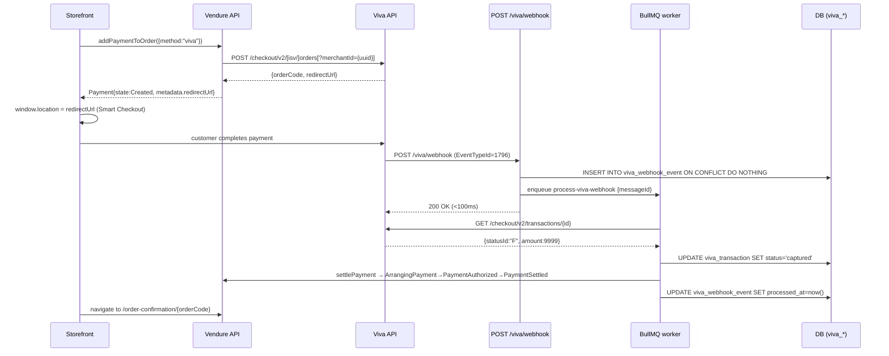

# @sakeetech/vendure-payment-viva

Vendure 3.x plugin for **Viva Wallet** payments — multi-mode (merchant + ISV).
Wraps [`@sakeetech/viva-payments-core`](../viva-payments-core) and provides a
complete Smart Checkout integration for Vendure storefronts: payment-method
handler, webhook receiver + BullMQ worker, admin REST endpoints, Shop API
`cancelPayment` mutation, and a `vendure-viva-register-webhooks` CLI.

---

> **v0.2.0 — alpha. Live demo verification pending.**
>
> Plugin now supports two operational modes: `merchant` (default, single-tenant)
> and `isv` (opt-in, multi-tenant under an ISV partner). Marketplace mode is
> reserved for a future release.
>
> Canonical references live in the repo's `docs/` directory (published with the
> package):
> [`docs/AUTH.md`](https://github.com/sakee-tech/vivawallet-npm-public/blob/main/docs/AUTH.md),
> [`docs/ENDPOINTS.md`](https://github.com/sakee-tech/vivawallet-npm-public/blob/main/docs/ENDPOINTS.md),
> [`docs/WEBHOOKS.md`](https://github.com/sakee-tech/vivawallet-npm-public/blob/main/docs/WEBHOOKS.md),
> [`docs/STATE-MACHINE.md`](https://github.com/sakee-tech/vivawallet-npm-public/blob/main/docs/STATE-MACHINE.md),
> [`docs/ERRORS.md`](https://github.com/sakee-tech/vivawallet-npm-public/blob/main/docs/ERRORS.md),
> [`docs/SECURITY.md`](https://github.com/sakee-tech/vivawallet-npm-public/blob/main/docs/SECURITY.md),
> [`docs/MIGRATION-0.1-to-0.2.md`](https://github.com/sakee-tech/vivawallet-npm-public/blob/main/docs/MIGRATION-0.1-to-0.2.md).

---

## Prerequisites

| Requirement | Notes |
|---|---|
| **Vendure 3.x** | `@vendure/core ^3.6.x` |
| **Postgres** | TypeORM-compatible. SQLite acceptable for unit tests only. |
| **A durable `JobQueueStrategy`** | The webhook flow runs through Vendure's job queue, so the queue **must survive a restart**. The in-memory default drops queued jobs on restart — a lost webhook leaves a payment stuck in `Created` indefinitely. Any persistent strategy satisfies this; `BullMQJobQueueStrategy` (from `@vendure/job-queue-plugin`, Redis-backed) is the recommended choice. The in-memory queue is fine for dev/tests only. |
| **A Viva account** | Merchant mode: direct merchant credentials (Self Care → Settings → API Access). ISV mode: ISV partner credentials. Demo + production use the same credential pair; `environment` flips the base URL. |
| **Node.js ≥ 20** | |

---

## Install

```bash
pnpm add @sakeetech/vendure-payment-viva
```

Peer dependencies (install alongside the plugin):

```bash
pnpm add @vendure/core @vendure/job-queue-plugin @nestjs/common @nestjs/core rxjs typeorm graphql
```

---

## Mode matrix

The plugin runs in one of two operational modes. **`merchant` is the default**
(90% case). Pass `mode: 'isv'` to `init()` to opt into ISV multi-tenant mode.

| Capability | `merchant` *(default)* | `isv` *(opt-in)* |
|---|---|---|
| **Who it's for** | Single direct Viva merchant — your storefront, your account | SaaS / platform onboarding many merchants under one ISV partner agreement |
| **Required credentials** | One OAuth2 pair (`clientId` / `clientSecret`) + one Basic pair (`legacyMerchantId` / `legacyApiKey`) | Platform-wide OAuth2 pair + legacy Basic pair + optional Reseller Basic pair (`reseller`) |
| **OAuth2 scope** | `urn:viva:payments:core:api:redirectcheckout` (+ `acquiring` for Fast Refund) | `urn:viva:payments:core:api:isv` (+ `acquiring`) |
| **Per-call merchant scoping** | None — token IS the merchant | `?merchantId={uuid}` query on every Smart Checkout / transaction call |
| **Onboarding flow** | None — merchant signs up with Viva directly | `POST /isv/v1/accounts` → hosted KYC → 8194 verification webhook |
| **Channel resolution** | `vivaSourceCode` only (no per-tenant merchantId) | `resolveMerchantId` callback or `ctx.channel.customFields.vivaMerchantId` |
| **Channel custom fields registered** | `vivaSourceCode`, `vivaApplePayDomainVerified` | …plus `vivaAccountId`, `vivaMerchantId`, `vivaPayoutsEnabled` |
| **Admin REST surface** | `GET /viva/internal/*`, `GET /viva/webhook/health` | …plus `POST/GET /viva/admin/connected-accounts/*`, `POST .../sources` |
| **Webhook registration** | Manual — Self Care UI; CLI prints the URLs + verification key | Automated — CLI calls `POST /isv/v1/webhooks` |
| **Webhook events handled** | 1796, 1797, 1798, 4865 | …plus 8193 (Account Connected), 8194 (Account Verification) |
| **Refund paths** | Fast Refund (Visa/MC) → Standard refund (legacy Basic auth) | Same, plus optional per-tenant approval state |
| **Storefront `cancelPayment` mutation** | mounted | mounted |

If `mode` is omitted, the plugin **defaults to `'merchant'`** and prints a
one-time startup warning. Set it explicitly to silence it. `mode` is also
auto-inferred as `'isv'` when only ISV-only fields (e.g. `resolveMerchantId`,
`onboardingReturnUrl`) are provided.

---

## Configuration

### Quick start — merchant mode

The 90% case. You have a single Viva merchant account and want to take payments
on a single Vendure storefront.

```ts
import { VivaPaymentPlugin } from '@sakeetech/vendure-payment-viva';

export const config: VendureConfig = {
  plugins: [
    VivaPaymentPlugin.init({
      mode: 'merchant',                        // default; can be omitted
      environment: 'demo',                     // 'demo' | 'production'
      clientId: process.env.VIVA_CLIENT_ID!,
      clientSecret: process.env.VIVA_CLIENT_SECRET!,
      legacyMerchantId: process.env.VIVA_MERCHANT_ID!,
      legacyApiKey: process.env.VIVA_API_KEY!,
      webhookVerificationKey: process.env.VIVA_WEBHOOK_VERIFICATION_KEY!,
      // ⚠️ successUrl/failureUrl are bookkeeping ONLY — they are not sent to Viva
      // and do not control the redirect. See "Post-payment redirect" below.
      successUrl: 'https://your-store.com/order-confirmation/{orderCode}',
      failureUrl: 'https://your-store.com/checkout?paymentCancelled=1',
      sourceCode: 'Default',                   // optional Smart Checkout source code
    }),
    BullMQJobQueuePlugin.init({ connection: redisConnectionOptions }),
  ],
};
```

Required env vars (merchant mode):

| Variable | Description |
|---|---|
| `VIVA_CLIENT_ID` | OAuth2 client_id — Smart Checkout creds from Self Care → API Access |
| `VIVA_CLIENT_SECRET` | OAuth2 client_secret — paired with `VIVA_CLIENT_ID` |
| `VIVA_MERCHANT_ID` | Legacy Basic-auth Merchant ID (UUID) — required for refunds (probe F1, 2026-04-25) |
| `VIVA_API_KEY` | Legacy Basic-auth API Key — paired with `VIVA_MERCHANT_ID` |
| `VIVA_WEBHOOK_VERIFICATION_KEY` | URL-verify response key. Fetched by the CLI on `--apply`. |

### Quick start — ISV mode (advanced / opt-in)

ISV mode is for SaaS platforms onboarding many merchants under one ISV partner
agreement with Viva. You hold platform-wide OAuth2 credentials; each merchant
goes through Viva's hosted KYC to attach to your platform.

```ts
import { VivaPaymentPlugin } from '@sakeetech/vendure-payment-viva';

export const config: VendureConfig = {
  plugins: [
    VivaPaymentPlugin.init({
      mode: 'isv',
      environment: 'demo',

      // Platform-wide ISV OAuth2 pair (same pair for demo + production).
      clientId: process.env.VIVA_CLIENT_ID!,
      clientSecret: process.env.VIVA_CLIENT_SECRET!,

      // Legacy Basic-auth pair — required in BOTH modes for refunds (probe F1).
      legacyMerchantId: process.env.VIVA_MERCHANT_ID!,
      legacyApiKey: process.env.VIVA_API_KEY!,

      webhookVerificationKey: process.env.VIVA_WEBHOOK_VERIFICATION_KEY!,
      successUrl: 'https://your-saas.com/order-confirmation/{orderCode}',
      failureUrl: 'https://your-saas.com/checkout?paymentCancelled=1',

      // Required by POST /isv/v1/accounts.
      onboardingReturnUrl: 'https://your-saas.com/admin/viva/onboarding-return',

      // Optional ISV branding shown on Viva's onboarding pages.
      // onboardingBranding: { partnerName: 'YourSaaS', logoUrl: 'https://...', primaryColor: '#1F2439' },

      // Per-channel resolvers (all optional — defaults read from Channel custom fields).
      // resolveMerchantId: (ctx) => ctx.channel.customFields.vivaMerchantId,
      // resolveSourceCode: (ctx) => ctx.channel.customFields.vivaSourceCode ?? 'Default',
      // resolveIsvAmount: (order, ctx) => 0,
      // resolveCheckoutColor: (ctx) => undefined,

      // Reseller Basic-auth — required only when calling
      // POST /viva/admin/connected-accounts/:id/sources (IsvSources).
      // All three fields are all-or-nothing.
      // reseller: {
      //   resellerId: process.env.VIVA_RESELLER_ID!,
      //   merchantId: process.env.VIVA_RESELLER_MERCHANT_ID!,
      //   resellerApiKey: process.env.VIVA_RESELLER_API_KEY!,
      // },
    }),
    BullMQJobQueuePlugin.init({ connection: redisConnectionOptions }),
  ],
};
```

### Required vs. optional fields

Discriminated on `mode`. Fields marked **shared** apply to both modes.

| Field | Mode | Required | Default |
|---|---|---|---|
| `mode` | — | no | `'merchant'` (auto-inferred as `'isv'` when ISV-only fields are present) |
| `environment` | shared | yes | — |
| `clientId` | shared | yes | — (alias: `isvClientId` accepted with deprecation warning) |
| `clientSecret` | shared | yes | — (alias: `isvClientSecret` accepted with deprecation warning) |
| `legacyMerchantId` | shared | yes | — (required for refunds — probe F1) |
| `legacyApiKey` | shared | yes | — (required for refunds — probe F1) |
| `webhookVerificationKey` | shared | yes | — |
| `successUrl` | shared | yes | — (bookkeeping only — **not** sent to Viva; see "Post-payment redirect") |
| `failureUrl` | shared | yes | — (bookkeeping only — **not** sent to Viva; see "Post-payment redirect") |
| `refundStrategy` | shared | no | `'auto'` (Fast → Standard fallback) |
| `sourceCode` | merchant | no | `'Default'` |
| `checkoutColor` | merchant | no | unset |
| `onboardingReturnUrl` | ISV | yes | — (rejected by `POST /isv/v1/accounts` if missing) |
| `onboardingBranding` | ISV | no | unset |
| `resolveMerchantId` | ISV | no | reads `ctx.channel.customFields.vivaMerchantId` |
| `resolveSourceCode` | ISV | no | reads `vivaSourceCode ?? 'Default'` |
| `resolveIsvAmount` | ISV | no | `() => 0` |
| `resolveCheckoutColor` | ISV | no | `() => undefined` |
| `reseller` | ISV | no | required only for `POST .../sources` route |
| `redlock` | shared | no | in-process semaphore (5 permits per merchantId per worker) |
| `logger` | shared | no | Vendure built-in |
| `metricsHook` | shared | no | noop |
| `tracer` | shared | no | noop |
| `webhookIpAllowlist` | shared | no | Viva published demo + production CIDRs |
| `trustedProxyDepth` | shared | no | `0` (socket only). Number of trailing `X-Forwarded-For` hops set by infrastructure you control. Required to be set correctly when a proxy/CDN sits in front — see "Webhook firewall configuration" below. |

### Post-payment redirect (`successUrl` / `failureUrl`)

**These options do not control where Viva sends the customer after payment.**
Viva's Smart Checkout has no per-order success-redirect field; the order returns
the customer to the **Success/Failure URLs configured on the payment _source_**
(`pathSuccess` / `pathFail`). The plugin resolves `successUrl`/`failureUrl`
(substituting `{orderCode}`) and stores them on the `viva_transaction` row
metadata for your own bookkeeping/observability — they are never transmitted to
Viva.

To set the real redirect target, configure the source one of two ways:

- **ISV mode** — create the merchant's e-commerce source with the redirect paths
  via the plugin's source-onboarding endpoint (`POST /isv/v1/sources`, fields
  `domain` / `pathSuccess` / `pathFail`).
- **Any mode** — set the Success/Failure URLs on the source in the Viva
  dashboard: **Self Care → Sales → Online Payments → Websites**.

(createOrder _does_ accept `urlFail` + `stateId=1`, but that is an
**expiry-only** redirect — it fires when the order times out, not on a decline —
so the plugin does not use it.) See
[#15](https://github.com/sakee-tech/vivawallet-npm-public/issues/15).

### Deprecated aliases (one-minor back-compat)

Accepted in `0.2.x` with a startup deprecation warning. **Removed in `0.3.0`.**

| Deprecated | Use instead |
|---|---|
| `isvClientId` | `clientId` |
| `isvClientSecret` | `clientSecret` |

> See [`docs/MIGRATION-0.1-to-0.2.md`](https://github.com/sakee-tech/vivawallet-npm-public/blob/main/docs/MIGRATION-0.1-to-0.2.md) for
> the full upgrade path.

---

## Channel custom fields

The plugin auto-registers custom fields on the `Channel` entity. Vendure
applies them automatically when the plugin is loaded — no manual migration
needed.

| Field | Type | Default | Modes | Written by |
|---|---|---|---|---|
| `vivaSourceCode` | `string \| null` | `'Default'` | both | Operator sets manually in Vendure admin; identifies the Smart Checkout source |
| `vivaApplePayDomainVerified` | `boolean` | `false` | both | Operator sets manually after completing the Apple Pay domain registration step in Viva Self Care (ops tracking only; does not gate payments) |
| `vivaAccountId` | `string \| null` | `null` | ISV only | Plugin writes at onboarding (`POST /viva/admin/connected-accounts`) |
| `vivaMerchantId` | `string \| null` | `null` | ISV only | Plugin writes automatically on Account Verification webhook (8194). Operator can also trigger via the reconcile endpoint |
| `vivaPayoutsEnabled` | `boolean` | `false` | ISV only | Plugin flips to `true` as the **last step** of Account Verification webhook processing (the storefront gate). `public: true` — readable from Shop API |

> Switching an existing deployment from `isv` → `merchant` (or back) does NOT
> drop columns — Vendure preserves operator data. The three ISV-only columns
> stay in place but unused. To reclaim them, drop manually.

---

## Quick start (full flow)

### 1. Add the plugin

```ts
// vendure-config.ts
import { VivaPaymentPlugin } from '@sakeetech/vendure-payment-viva';

export const config: VendureConfig = {
  plugins: [
    VivaPaymentPlugin.init({ /* see Configuration above */ }),
    // BullMQJobQueuePlugin is required for webhook processing
    BullMQJobQueuePlugin.init({ connection: redisConnectionOptions }),
  ],
};
```

### 2. Run migrations

```bash
# Generates the initial migration (creates viva_transaction + viva_webhook_event tables)
npx vendure migrate
```

Channel custom fields are auto-registered — no separate migration step.

### 3. Set environment variables

```bash
# Merchant mode
VIVA_CLIENT_ID=your-smart-checkout-client-id
VIVA_CLIENT_SECRET=your-smart-checkout-client-secret
VIVA_MERCHANT_ID=your-merchant-uuid
VIVA_API_KEY=your-api-key
VIVA_WEBHOOK_VERIFICATION_KEY=    # leave empty until step 4
VIVA_WEBHOOK_URL=https://your-store.com/viva/webhook
```

### 4. Register webhooks

The plugin ships a CLI `vendure-viva-register-webhooks`. Mode-aware behaviour:

**Merchant mode** — Viva offers no programmatic webhook-registration API for
direct merchants. The CLI fetches the verification key via
`GET /api/messages/config/token` (Basic auth) and prints the URLs to paste
into Self Care.

```bash
VIVA_MODE=merchant pnpm vendure-viva-register-webhooks --apply
# Prints:
#   Manual webhook setup required (merchant mode).
#   1. Go to Viva Self Care → Sales → API Access → Webhooks.
#   2. For each event below, register the URL with your storefront base URL:
#        Transaction Payment Created (1796):  https://your-store.com/viva/webhook
#        Transaction Reversal Created (1797): https://your-store.com/viva/webhook
#        Transaction Payment Failed (1798):   https://your-store.com/viva/webhook
#        Order Updated (4865):                https://your-store.com/viva/webhook
#   3. Paste this verification key into VIVA_WEBHOOK_VERIFICATION_KEY:
#        <uuid-printed-here>
#   4. Restart your Vendure server.
```

**ISV mode** — registers one webhook URL per V1 event type at the ISV partner
level (one URL covers all merchants). Idempotent — re-running emits
`SKIP_ALREADY_REGISTERED` and exits 0.

```bash
# Preview (no changes applied)
VIVA_MODE=isv pnpm vendure-viva-register-webhooks --dry-run

# Apply — POSTs /isv/v1/webhooks per V1 event type (1796, 1797, 1798, 4865, 8193, 8194)
VIVA_MODE=isv pnpm vendure-viva-register-webhooks --apply

# Drift reconciliation (ISV — currently a warning no-op; the ISV API exposes
# no list/deactivate endpoints, probe-verified 2026-05-11)
VIVA_MODE=isv pnpm vendure-viva-register-webhooks --reconcile-drift
```

Paste the verification key into `.env` and restart.

> See [`docs/WEBHOOKS.md`](https://github.com/sakee-tech/vivawallet-npm-public/blob/main/docs/WEBHOOKS.md) for the full envelope shape
> and per-event payload reference.

### 5. (ISV mode only) Onboard a channel

```bash
curl -X POST https://your-saas.com/viva/admin/connected-accounts \
  -H 'Authorization: Bearer <superadmin-token>' \
  -H 'Content-Type: application/json' \
  -d '{"channelId": 1}'
# → { "accountId": "...", "onboardingUrl": "https://..." }
```

Send the `onboardingUrl` to the shop principal. They complete Viva's hosted KYC.
When Viva verifies the account, webhook 8194 fires automatically and the plugin
writes `vivaMerchantId` + flips `vivaPayoutsEnabled=true`.

In **merchant mode**, no onboarding step is needed — your single merchant
account is implicit.

### 6. Storefront integration

```graphql
# Storefront: add payment to order (Viva handler returns redirectUrl in metadata)
mutation {
  addPaymentToOrder(input: { method: "viva", metadata: {} }) {
    ... on Order {
      id
      state
      payments {
        id
        state
        metadata  # contains redirectUrl
      }
    }
  }
}
```

After receiving the payment, redirect the customer to `metadata.redirectUrl`.

On return from Smart Checkout, handle the cancel case:

```graphql
# Storefront: ?paymentCancelled=1 → cancel the payment
mutation CancelPayment($paymentId: ID!) {
  cancelPayment(paymentId: $paymentId) {
    ... on Order { id state }
    ... on CancelPaymentError { errorCode message }
  }
}
```

---

## REST contract

All admin endpoints require `Permission.SuperAdmin`. Mode availability:

| Path | merchant | isv |
|---|---|---|
| `GET` `/viva/internal/auth-status` | mounted | mounted |
| `GET` `/viva/webhook/health` | mounted | mounted |
| `GET` `/viva/metrics` | mounted | mounted |
| `GET` `/viva/webhook` | mounted | mounted |
| `POST` `/viva/webhook` | mounted | mounted |
| `POST` `/viva/admin/connected-accounts` | 404 | mounted |
| `GET` `/viva/admin/connected-accounts/:channelId` | 404 | mounted |
| `POST` `/viva/admin/connected-accounts/:channelId/reconcile` | 404 | mounted |
| `POST` `/viva/admin/connected-accounts/:id/sources` | 404 | mounted (requires `reseller` config or returns 412) |

ISV-only routes return `404 not_found` in merchant mode (per-handler
short-circuit). The `POST .../sources` route is **new in v0.2.0** — creates a
Smart Checkout source via `POST /api/sources` against the Reseller Basic-auth
legacy host. Returns `412 VIVA_RESELLER_CREDENTIALS_MISSING` if `reseller` is
not configured.

> Full path detail, request / response shapes, and curl examples in
> [`docs/ENDPOINTS.md`](https://github.com/sakee-tech/vivawallet-npm-public/blob/main/docs/ENDPOINTS.md) §3 (adapter endpoints).

### `POST /viva/admin/connected-accounts` *(ISV only)*

```bash
curl -X POST https://your-saas.com/viva/admin/connected-accounts \
  -H 'Authorization: Bearer <token>' \
  -H 'Content-Type: application/json' \
  -d '{"channelId": 1, "sellerId": "optional-seller-id"}'
```

Response `200`:

```json
{
  "accountId": "eeeeeeee-ffff-0000-1111-222222222222",
  "onboardingUrl": "https://www.vivapayments.com/onboarding/..."
}
```

### `GET /viva/admin/connected-accounts/:channelId` *(ISV only)*

Response `200`:

```json
{
  "accountId": "eeeeeeee-ffff-0000-1111-222222222222",
  "merchantId": "cccccccc-dddd-eeee-ffff-000000000001",
  "payoutsEnabled": true,
  "verificationStatus": "Approved",
  "applePayDomainVerified": false
}
```

### `POST /viva/admin/connected-accounts/:channelId/reconcile` *(ISV only)*

Replays steps 6a–6c of the onboarding flow (retrieve account → write
`merchantId` → flip `payoutsEnabled`). Use this if webhook 8194 was missed.

```json
{
  "merchantId": "cccccccc-dddd-eeee-ffff-000000000001",
  "payoutsEnabled": true
}
```

### `POST /viva/admin/connected-accounts/:id/sources` *(ISV only, new in v0.2.0)*

Creates an ecommerce or physical payment source on a connected merchant's
account via `POST /api/sources` (Reseller Basic auth). Returns `412
VIVA_RESELLER_CREDENTIALS_MISSING` when `options.reseller` is absent; `409
VIVA_ACCOUNT_NOT_VERIFIED` when the account hasn't completed KYC.

### `GET /viva/internal/auth-status`

```json
{
  "token_present": true,
  "token_expires_at": "2026-04-25T11:00:00.000Z",
  "last_refresh_at": "2026-04-25T10:00:00.000Z"
}
```

### `GET /viva/webhook/health`

```json
{
  "events_received_24h": 42,
  "events_pending": 0,
  "oldest_pending_age_seconds": 0,
  "last_processed_at": "2026-04-25T10:01:23.000Z"
}
```

### Webhook endpoints

| Verb | Path | Auth | Description |
|---|---|---|---|
| `GET` | `/viva/webhook` | IP allowlist + URL-verify handshake | Returns `{"Key": "<verification-key>"}` during Viva's registration / re-verification probe |
| `POST` | `/viva/webhook` | IP allowlist | Receive Viva event. INSERT-OR-IGNORE on `MessageId`. Enqueue BullMQ job if newly inserted. Always returns 200. |

> Receiver auth model + IP allowlist details in
> [`docs/SECURITY.md`](https://github.com/sakee-tech/vivawallet-npm-public/blob/main/docs/SECURITY.md) and
> [`docs/WEBHOOKS.md`](https://github.com/sakee-tech/vivawallet-npm-public/blob/main/docs/WEBHOOKS.md) §2.

### Webhook firewall configuration

The in-app IP allowlist is one of **two layers** Viva's docs require:

> "whitelist the below IP addresses/ranges in **both your server and in your network firewall**" — Viva docs, `webhooks-for-payments.txt`

This package handles the application layer. The network layer is your
responsibility. Without the network-layer block, an attacker can hit your
deployment with a spoofed `X-Forwarded-For` and bypass the in-app check if
`trustedProxyDepth` is misconfigured.

**Viva published source IPs** (from
`references/viva-docs/md/webhooks-for-payments.txt`):

```
# Production
51.138.37.238  20.61.40.108  13.80.70.181  13.80.71.6  13.79.28.70  40.74.88.139
2603:1020:201::/48  2603:1020:206::/48  2603:1020:204::/47
2603:1020:300::/48  2603:1020:302::/48  2603:1020:301::/47

# Demo
40.91.219.176  20.224.241.71  2603:1020:600::/48
```

**Setting `trustedProxyDepth` correctly:**

| Deployment | Value | Why |
|---|---|---|
| Direct exposure (no proxy) | `0` (default) | Use socket; ignore `X-Forwarded-For` entirely. |
| Single reverse proxy (nginx, Caddy, Traefik) | `1` | Trust the rightmost X-F-F entry. |
| ALB / Fly.io / Railway / Render | `1` | Each appends one X-F-F hop. |
| Cloudflare → ALB | `2` | CDN + LB each append one. |

Setting this too high is unsafe (the helper picks an attacker-controllable
entry). Setting it too low rejects legitimate webhooks. Verify with a
manual `curl` against a non-prod deployment.

**nginx — strip incoming `X-Forwarded-For`:**

```nginx
location /viva/webhook {
    proxy_set_header X-Forwarded-For $remote_addr;
    proxy_set_header X-Real-IP $remote_addr;
    proxy_pass http://vendure-upstream;
}
```

**Cloudflare WAF rule:**

```
(http.request.uri.path eq "/viva/webhook"
  and http.request.method eq "POST"
  and not (ip.src in {51.138.37.238 20.61.40.108 13.80.70.181 13.80.71.6
                       13.79.28.70 40.74.88.139}))
```

**AWS ALB — security group:** allow inbound TCP 443 only from the Viva
CIDRs above. The in-app allowlist becomes defence-in-depth.

### Shop API extension

```graphql
extend type Mutation {
  """
  Cancel a Vendure payment by ID.
  Voids the Viva-side authorization (DELETE /checkout/v2/orders/{orderCode})
  AND transitions the order back to AddingItems.
  Storefront calls this on ?paymentCancelled=1.
  Permission: order owner (active customer or active anonymous order).
  """
  cancelPayment(paymentId: ID!): CancelPaymentResult!
}

union CancelPaymentResult = Order | CancelPaymentError

type CancelPaymentError implements ErrorResult {
  errorCode: ErrorCode!
  message: String!
  vivaErrorCode: Int
  vivaErrorMessage: String
}
```

`errorCode` is Vendure's core `ErrorCode!` enum (every `ErrorResult` must use it).
The plugin extends that enum with its own reason codes (`VIVA_PAYMENT_NOT_CANCELLABLE`,
`AUTHORIZATION_FAILED`, `VIVA_API_ERROR`, …) so they are valid enum members at runtime.

---

## Refund strategy

Refunds default to `refundStrategy: 'auto'` — try Fast Refund first, fall back
to Standard refund on `403 not eligible`.

| Strategy | Behaviour | When to use |
|---|---|---|
| `'auto'` *(default)* | Fast Refund first (Visa/MC e-commerce only). Falls back to Standard refund on `403 VIVA_FAST_REFUND_INELIGIBLE`. The fallback is transparent — caller never sees the 403. | Most users. Transparent upgrade. |
| `'fast'` | Forces Fast Refund. Surfaces `VIVA_FAST_REFUND_INELIGIBLE` to the caller on ineligibility. | Merchants approved for Fast Refund who want explicit failures rather than silent fallback. |
| `'standard'` | Skips Fast Refund entirely. Always uses `POST /api/transactions/{id}` (legacy Basic auth). | Merchants not approved for Fast Refund by Viva sales, or those who want one consistent refund path. |

Eligibility (auto + fast): Viva approves Fast Refund per-merchant; card must
be Visa or Mastercard; transaction must be card-not-present (e-commerce).

> Path detail in [`docs/ENDPOINTS.md`](https://github.com/sakee-tech/vivawallet-npm-public/blob/main/docs/ENDPOINTS.md) §5 (Fast
> Refund + Standard refund).

---

## Error contract

All plugin errors — REST responses, job failures, and the `cancelPayment`
mutation — share one envelope:

```ts
type VivaPluginError = {
  code: VivaErrorCode;
  message: string;
  retryable: boolean;
  vivaErrorCode?: number;      // Viva's own error code, when available
  vivaErrorMessage?: string;   // Viva's own error message, when available
};
```

REST responses: HTTP `5xx` for retryable errors (`VIVA_AUTH_DOWN`); HTTP `4xx`
for all others. The `cancelPayment` mutation returns the `CancelPaymentError`
union member with the envelope flattened into `errorCode` + `message`.

| Code | HTTP | Retryable | When it fires |
|---|---|---|---|
| `VIVA_AUTH_DOWN` | 503 | yes | OAuth2 token unavailable at bootstrap or runtime (Viva 5xx / timeout) |
| `VIVA_API_ERROR` | 502 | no | Viva 4xx not covered by a specific code below. Passes through Viva's `errorCode` + `message` |
| `VIVA_ACCOUNT_NOT_VERIFIED` | 400 | no | (ISV) `createPayment` called on a channel where `vivaPayoutsEnabled=false` or `vivaMerchantId` is missing |
| `VIVA_ISV_AMOUNT_TOO_HIGH` | 400 | no | (ISV) `resolveIsvAmount` returned a value ≥ the order total (pre-call guard) |
| `VIVA_CHANNEL_MISCONFIGURED` | 400 | no | (ISV) `resolveMerchantId` returned `undefined` |
| `VIVA_ORDER_NOT_FOUND` | 404 | no | Retrieve Transaction returned not-found, or Vendure payment not found |
| `VIVA_AMOUNT_MISMATCH` | 422 | no | Retrieve Transaction amount ≠ `viva_transaction.amount_minor` (webhook job path — `processed_at` stays NULL) |
| `VIVA_REFUND_REJECTED` | 422 | no | Viva 4xx on refund request |
| `VIVA_PAYMENT_ALREADY_SETTLED` | 409 | no | Settle attempted on already-settled payment |
| `VIVA_PAYMENT_NOT_CANCELLABLE` | 409 | no | Cancel attempted on already-settled or already-cancelled payment |
| `VIVA_ALREADY_ONBOARDED` | 409 | no | (ISV) `POST /viva/admin/connected-accounts` called on a channel that already has `vivaAccountId` |
| `VIVA_RESELLER_CREDENTIALS_MISSING` | 412 | no | **(new v0.2.0)** `POST .../sources` called without `options.reseller` |
| `VIVA_SOURCE_CREATION_FAILED` | 422 | no | **(new v0.2.0)** Viva 4xx on `POST /api/sources` |
| `VIVA_FAST_REFUND_INELIGIBLE` | 403 | no | **(new v0.2.0)** (`refundStrategy='fast'` only) Card scheme isn't Visa/MC, or merchant not approved. With `'auto'` this is caught internally and never surfaces. |
| `VIVA_MODE_MISMATCH` | 400 | no | **(new v0.2.0)** ISV-only entry point invoked while plugin is in merchant mode (surfaced from `@sakeetech/viva-payments-core/errors`) |
| `VIVA_INTERNAL_ERROR` | 500 | no | Catch-all for unexpected failures. Indicates a bug |

> Full catalogue + Viva→plugin mapping rules in
> [`docs/ERRORS.md`](https://github.com/sakee-tech/vivawallet-npm-public/blob/main/docs/ERRORS.md).

---

## Field-write order on Account Verification webhook *(ISV mode)*

When webhook 8194 (Account Verification Status Changed) fires, the plugin
performs two writes to the channel's custom fields. **The order is mandatory:**

1. **`vivaMerchantId` is written first.** This gives the payment handler a
   valid merchantId to use in Viva API calls.
2. **`vivaPayoutsEnabled` is flipped `true` last.** This is the storefront
   gate — `createPayment` guards on `vivaPayoutsEnabled=true`. Only after
   `vivaMerchantId` is present is it safe to open the gate.

If the writes were reversed — payouts enabled before merchantId is set — a
storefront call could slip through the gate and land on `createPayment` with
`vivaMerchantId=null`, throwing `VIVA_CHANNEL_MISCONFIGURED`.

This write order is enforced in both the webhook job handler and the reconcile
endpoint.

---

## Webhook flow

### Sequence diagram



### Narrative

1. `addPaymentToOrder(method:"viva")` invokes
   `PaymentMethodHandler.createPayment`. The handler chooses the merchant- or
   ISV-mode Smart Checkout endpoint, receives an `orderCode`, constructs the
   redirect URL, and returns Vendure state `Created` with `metadata.redirectUrl`.

2. The storefront redirects the customer to Smart Checkout. The customer
   completes (or cancels) payment on Viva's hosted page.

3. Viva fires webhook `1796` (Payment Created). The plugin's `POST
   /viva/webhook` controller:
   - Validates source IP against the allowlist.
   - Runs `INSERT INTO viva_webhook_event ... ON CONFLICT (message_id) DO
     NOTHING` (idempotent dedupe by `MessageId`).
   - If the row was newly inserted, enqueues a BullMQ job and returns 200
     immediately (latency target: <100ms server-side, no Viva API call in the
     receive path).

4. The BullMQ worker processes the job:
   - Calls `GET /checkout/v2/transactions/{transactionId}` to retrieve the
     transaction (Retrieve-Transaction-before-settle pattern).
   - Validates `statusId='F'` (Finished) and that the `amount` matches
     `viva_transaction.amount_minor` (mismatch → `VIVA_AMOUNT_MISMATCH`,
     `processed_at` stays NULL).
   - Transitions the order: `ArrangingPayment → PaymentAuthorized →
     PaymentSettled`.
   - Marks the webhook event row `processed_at = now()`.

5. If the order was already rolled back to `AddingItems` by a sweep job, the
   worker performs a stale-order re-walk to bring it back to `PaymentSettled`.

> Full state machine, transition rules, and stale-order re-walk in
> [`docs/STATE-MACHINE.md`](https://github.com/sakee-tech/vivawallet-npm-public/blob/main/docs/STATE-MACHINE.md).

---

## Multi-channel setup *(ISV mode)*

The plugin is ISV multi-tenant by design when `mode: 'isv'`. Every deployed
channel is a separate Viva merchant. Steps for adding a new channel:

1. Create the channel in Vendure (admin UI or API).
2. Set `vivaSourceCode` on the channel's custom fields to the desired Smart
   Checkout source code (e.g. `'Default'`).
3. Call `POST /viva/admin/connected-accounts` with `{channelId}` to initiate
   onboarding. Returns `{accountId, onboardingUrl}`.
4. Send `onboardingUrl` to the channel's principal for KYC.
5. Wait for webhook 8194. The plugin writes `vivaMerchantId` + flips
   `vivaPayoutsEnabled=true` automatically.
6. The storefront on that channel can now call
   `addPaymentToOrder(method:"viva")`.

Webhook registration is ISV-level (one URL per event type covers all
merchants). No per-channel webhook configuration is needed.

In **merchant mode**, every channel shares the single configured merchant
account. Per-channel `vivaSourceCode` is still respected.

---

## Apple Pay — manual step required

> **WARNING:** Native Apple Pay domain registration is **not exposed by Viva
> to any integrator** (merchant or ISV). Domain registration must be performed
> manually through Viva Self Care for each storefront domain.

Steps:
1. Navigate to Viva Self Care → Smart Checkout → Apple Pay Domain Verification.
2. Complete the domain challenge for each storefront domain.
3. Set `vivaApplePayDomainVerified=true` on the relevant channel custom field
   (ops tracking only — the plugin does not use this field to gate Apple Pay).

There is no CLI or API call that can automate this step.

---

## Operator runbook

### Onboarding a new shop *(ISV mode)*

1. `POST /viva/admin/connected-accounts {channelId}` — initiate onboarding.
2. Send the returned `onboardingUrl` to the shop principal.
3. Principal completes Viva's KYC at the URL.
4. Wait for Viva to fire webhook 8194 (can take minutes to hours after KYC
   submission).
5. Verify: `GET /viva/admin/connected-accounts/:channelId` should show
   `"payoutsEnabled": true` and a non-null `merchantId`.
6. If 8194 never arrived (check `/viva/webhook/health` and the
   `viva_webhook_event` table), call
   `POST /viva/admin/connected-accounts/:channelId/reconcile` to re-run the
   account retrieval + write sequence manually.

### Webhook registration and drift reconciliation

```bash
# Merchant mode — re-fetch verification key and re-print manual setup
VIVA_MODE=merchant pnpm vendure-viva-register-webhooks --apply

# ISV mode — diff registered URLs vs. desired set (currently a warning no-op)
VIVA_MODE=isv pnpm vendure-viva-register-webhooks --reconcile-drift

# ISV mode — re-register (idempotent; emits SKIP_ALREADY_REGISTERED on dupes)
VIVA_MODE=isv pnpm vendure-viva-register-webhooks --apply
```

The verification key (`VIVA_WEBHOOK_VERIFICATION_KEY`) is generated once per
deployment, stored in `.env`, and used to respond to Viva's GET URL-verify
probe. Never rotate it without also updating it in Viva Self Care (merchant
mode) or re-registering (ISV mode).

### Troubleshooting: payment stuck in Created

**Symptom:** Customer completed Smart Checkout but the order is still in
`ArrangingPayment` and the payment shows state `Created`.

**Cause:** Webhook 1796 was not received or not processed.

**Steps:**
1. Check `GET /viva/webhook/health` — look at `events_pending` and
   `oldest_pending_age_seconds`.
2. Query `SELECT * FROM viva_webhook_event WHERE processed_at IS NULL` — find
   the stuck row.
3. Check the `error` column for the failure reason (common: `retrieve-failed`,
   `channel-not-found`, `VIVA_AMOUNT_MISMATCH`).
4. If the row is missing entirely, the webhook was not received — check IP
   allowlist and Viva dashboard for delivery errors.
5. If the row exists with `error='channel-not-found'` (ISV), the channel's
   `vivaMerchantId` was not set at the time of processing. Call
   `POST /viva/admin/connected-accounts/:channelId/reconcile` then clear the
   row's `error` and `processed_at=NULL` to allow re-processing.

### Troubleshooting: payment in ArrangingPayment too long (stale orders)

**Symptom:** Order has been in `ArrangingPayment` for more than the
stale-order threshold (configurable via the retention job).

**Cause:** Either the customer abandoned the Smart Checkout, or the webhook
was received but the settle transition failed (check
`viva_webhook_event.error`).

**Recovery:** The retention cleanup job (runs daily via Vendure scheduler)
deletes `viva_webhook_event` rows with `processed_at < now() - 90 days`.
Stale orders require manual intervention (or a separate sweep job configured
by the SaaS).

### Reading metrics and alerts

```bash
curl https://your-vendure.com/viva/metrics -H 'Authorization: Bearer <token>'
```

Key counters to alert on:
- `viva_webhook_events_pending_total > 10` — webhook processing is falling behind.
- `viva_auth_refresh_errors_total > 0` — OAuth2 token renewal is failing.
- `viva_amount_mismatch_total > 0` — payment amounts are diverging from Viva.

### Manual paste of merchantId via reconcile endpoint *(ISV mode)*

If webhook 8194 was missed and `vivaMerchantId` is still null:

```bash
# 1. Find the accountId on the channel
curl https://your-saas.com/viva/admin/connected-accounts/1 \
  -H 'Authorization: Bearer <token>'

# 2. Trigger reconciliation (re-fetches from Viva, writes merchantId + payoutsEnabled)
curl -X POST https://your-saas.com/viva/admin/connected-accounts/1/reconcile \
  -H 'Authorization: Bearer <token>'
```

---

## Upgrading from 0.1.x

The `0.1.x` plugin was ISV-only. To upgrade in-place without behaviour change:

1. Add `mode: 'isv'` to your `VivaPaymentPlugin.init({…})` call.
2. Rename `isvClientId` → `clientId`, `isvClientSecret` → `clientSecret` (old
   names still work for one minor with a deprecation warning; removed in
   `0.3.0`).
3. No DB migration needed — channel custom field shape is unchanged for ISV
   deployments.

> Full upgrade path, env-var rename matrix, and rollback steps in
> [`docs/MIGRATION-0.1-to-0.2.md`](https://github.com/sakee-tech/vivawallet-npm-public/blob/main/docs/MIGRATION-0.1-to-0.2.md).

---

## Limitations / out of scope

| Limitation | Notes |
|---|---|
| **Native Apple Pay domain registration via API** | Viva does not expose this endpoint to any integrator. Manual step required (see §Apple Pay). |
| **Marketplace mode** | Reserved in the config union; not shipped in `v0.2.x`. |
| **Pre-auth-only flow** | Immediate-capture via Smart Checkout only — both modes. |
| **Subscription / recurring payments** | Not supported by this plugin. |
| **Admin UI extension** | SaaS owns the admin UI. Plugin ships the REST contract; SaaS integrates it. |
| **4865 Order Updated exact payload shape** | Viva's docs do not fully document the 4865 payload. Plugin defensively treats `StatusId ∈ {X, C, E}` as cancellation; will tighten after first live observation. |
| **Idempotency header server-side dedupe** | `Idempotency-Key` sent on all requests but not server-side deduped by Viva (probe F2, 2026-04-25). Local `viva_transaction` row is authoritative for dedup. |
| **Refund via legacy host** | Probe F1 (2026-04-25): `POST /checkout/v2/transactions/{id}` on v2/OAuth2 returns 405. Plugin uses `POST /api/transactions/{id}` on `demo.vivapayments.com`/`www.vivapayments.com` with Basic auth — requires `legacyMerchantId` + `legacyApiKey` in plugin options. |

---

## Sandbox testing notes

Fixture replay tests live in `test/sandbox/`:

```
test/sandbox/
├── fixtures/
│   ├── webhook-1796-payment-created.json
│   ├── webhook-1798-failed.json
│   ├── webhook-4865-order-updated.json
│   ├── webhook-8194-account-verification.json
│   ├── webhook-8194-account-verification-declined.json
│   ├── retrieve-transaction-finished.json
│   ├── retrieve-transaction-not-found.json
│   └── connected-account-verified.json
├── replay-harness.ts
└── replay.test.ts
```

All fixture `merchantId`, `transactionId`, and `accountId` values are stable
test UUIDs. No real Viva credentials appear in any fixture.

### Refreshing fixtures from real Viva captures

1. Run the plugin in `demo` environment against a Viva sandbox account.
2. Capture the raw webhook body from your server logs (the `payload` column in
   `viva_webhook_event`).
3. Replace the corresponding fixture file's content.
4. **Sanitise:** replace any real `MerchantId` with
   `cccccccc-dddd-eeee-ffff-000000000001`, any real `ConnectedAccountId` with
   `eeeeeeee-ffff-0000-1111-222222222222`, and any real `TransactionId` with
   `aaaaaaaa-1111-2222-3333-bbbbbbbbbbbb`.
5. Keep `CardNumber` masked (`414746XXXXXX0133` format). Never commit real
   card data.

---

## Versioning and roadmap

See [CHANGELOG.md](./CHANGELOG.md).

Open items after `0.2.0`:

- First live demo verification (shared with Medusa adapter — resolves
  idempotency-header semantics, refund unit ambiguity, webhook amount unit).
- Marketplace mode (reserved seams — no timeline).
- Pre-auth-only flow (no timeline).

---

## License

MIT. See [LICENSE](./LICENSE).

---

## Contributing

Internal SaaS use. Contributions welcome once `0.2.0` stabilises after the
first live demo. Open issues or discussions in the project repository.

Local development:

```bash
pnpm -F @sakeetech/vendure-payment-viva typecheck
pnpm -F @sakeetech/vendure-payment-viva test
pnpm -F @sakeetech/vendure-payment-viva build
```
